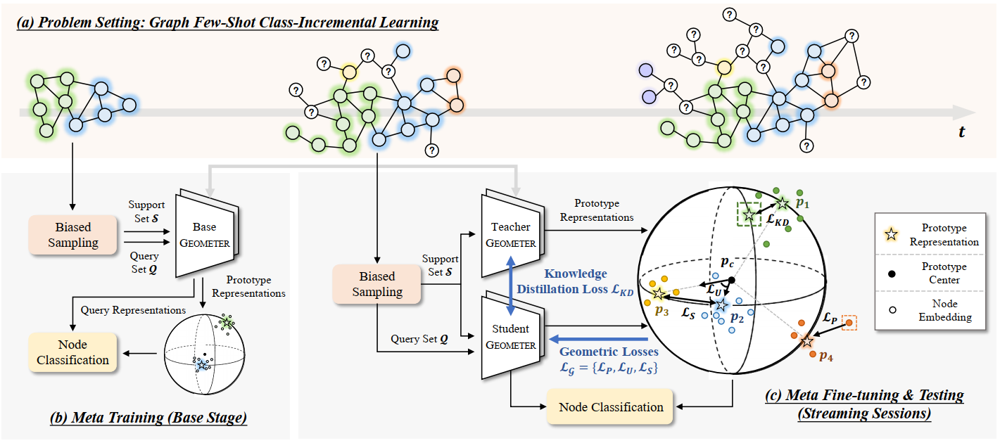

# GPR
Graph Few-Shot Class-Incremental Learning via Prototype Representation



## Requirements
- pytorch >= 1.8.1
- numpy >= 1.21.3
- scikit-learn >= 0.24.2
- pytorch geometric >= 2.0.2
- pyaml
- tensorboardX
- tqdm

## How to run
```bash
python main.py --config_filename='config/config_cora_stream.yaml' --iteration 10 
```
